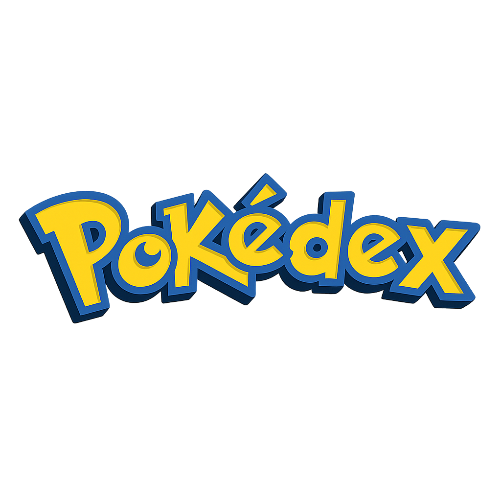

\*\*Gere uma imagem como png do texto pokedex na fonte pokemon
O ChatGPT disse:

---

Faça o botao de up e down fazer o controle do conteudo que esta sendo projetado quando houver scroll
// codigo da classe
O ChatGPT disse:
Sim! Dá pra melhorar pra que o scroll continue enquanto o botão estiver pressionado, usando um setInterval no mousedown e limpando no mouseup ou mouseleave.

1. Adicione controle de intervalo ao seu componente:
   ts
   Copiar
   Editar
   scrollIntervalId: any;

startScroll(direction: 'up' | 'down') {
const el = this.screenRef?.nativeElement;
if (!el) return;

const step = direction === 'up' ? -this.scrollAmount : this.scrollAmount;

this.scrollIntervalId = setInterval(() => {
el.scrollBy({ top: step, behavior: 'smooth' });
}, 100); // controla a velocidade do scroll
}

stopScroll() {
if (this.scrollIntervalId) {
clearInterval(this.scrollIntervalId);
this.scrollIntervalId = null;
}
} 2. No HTML (pokedex.html), ligue os eventos:
html
Copiar
Editar

  

  

---

\*\*Faça methodos dividindo as responsabilidades
Código:
getPokemons getPokemons(pageSize: number, pageIndex: number, filter: string) {
const storage = this.storage.getItem('pokemons');
const expirationTime = this.storage.getItem('expiration-time');

    const skip = pageIndex * pageSize;
    const limit = skip + pageSize;
    const now = Date.now();
    const isExpired = !expirationTime || now > expirationTime;

    this.count = this.storage.getItem('count');

    if (storage?.length && !isExpired) {
      console.log(isExpired);
      const data = storage.filter((item: PokemonResponse) =>
        item.name.toLowerCase().includes(filter.toLowerCase())
      );
      this.count = data.length;
      return of(data.slice(skip, limit));
    }

    return this.pokeApi.getAllPokemons(pageSize, skip).pipe(
      switchMap((response) => {
        const pokemons = response.results.map((pokemon) => {
          return this.transformInPokemonCard(pokemon);
        });

        const detalhes = pokemons.map((item) =>
          this.pokeApi.getPokemonId(item.id)
        );

        return combineLatest(detalhes).pipe(
          switchMap((pokemonsDetalhes) => {
            return of({
              results: pokemonsDetalhes,
              count: response.count,
            });
          })
        );
      }),
      switchMap((response) => {
        const pokemons = response.results.map((pokemon) => {
          return {
            name: pokemon.name,
            id: pokemon.id,
            spriteUrl: pokemon.sprites.front_default,
            types: pokemon.types?.map((item) => item.type.name),
            abilities: pokemon.abilities?.map((item) => item.ability.name),
            height: pokemon.height,
            weight: pokemon.weight,
            baseExperience: pokemon.base_experience,
            moves: pokemon.moves?.map((item) => item.move.name),
            stats: pokemon.stats?.map((value) => {
              return {
                name: value.stat.name,
                value: value.base_stat,
              };
            }),
          };
        });

        const fiveMinutes = 5 * 60 * 1000;
        const expiration = now + fiveMinutes;
        const listSorted = pokemons.sort((a, b) => a.id - b.id);
        console.log('createAt', now);
        console.log('expirationTime', expiration);
        this.storage.setItem('count', response.count);
        this.storage.setItem('createAt', now);

        if (!storage?.length) {
          this.storage.setItem('pokemons', listSorted);
          this.storage.setItem('expirationTime', expiration);
        }
        return of(pokemons);
      })
    );

}

private transformInPokemonCard(pokemon: PokemonPaginatedResponse) {
const splittedUrl = pokemon.url.split('/');
const id = +splittedUrl[splittedUrl.length - 2];
return {
id,
...pokemon,
};
}
O ChatGPT disse:
Perfeito! Vamos dividir esse getPokemons() em métodos menores e bem nomeados, seguindo os princípios de responsabilidade única, legibilidade e reutilização.

✅ Refatoração sugerida

1. getPokemons() → ponto de entrada, decide entre cache e requisição
2. shouldUseCache() → valida cache
3. filterAndPaginateFromCache() → trata filtro e paginação local
4. fetchAndCachePokemons() → busca da API e atualiza cache
5. transformApiResponse() → transforma estrutura detalhada
6. transformInPokemonCard() → já criado, mantido

🧱 Código refatorado:
ts
Copiar
Editar
getPokemons(pageSize: number, pageIndex: number, filter: string) {
const skip = pageIndex \* pageSize;
const limit = skip + pageSize;

if (this.shouldUseCache()) {
return of(this.filterAndPaginateFromCache(filter, skip, limit));
}

return this.fetchAndCachePokemons(pageSize, skip, filter);
}

private shouldUseCache(): boolean {
const expirationTime = this.storage.getItem('expirationTime');
const storage = this.storage.getItem('pokemons');
const now = Date.now();
const isExpired = !expirationTime || now > expirationTime;

return storage?.length && !isExpired;
}

private filterAndPaginateFromCache(filter: string, skip: number, limit: number) {
const storage = this.storage.getItem('pokemons') ?? [];
const filtered = storage.filter((item: PokemonResponse) =>
item.name.toLowerCase().includes(filter.toLowerCase())
);
this.count = filtered.length;
return filtered.slice(skip, limit);
}

private fetchAndCachePokemons(pageSize: number, skip: number, filter: string) {
return this.pokeApi.getAllPokemons(pageSize, skip).pipe(
switchMap((response) => {
const base = response.results.map((pokemon) => this.transformInPokemonCard(pokemon));
const detalhes = base.map((item) => this.pokeApi.getPokemonId(item.id));

      return combineLatest(detalhes).pipe(
        switchMap((pokemonsDetalhes) =>
          of({ results: pokemonsDetalhes, count: response.count })
        )
      );
    }),
    switchMap((response) => {
      const list = this.transformApiResponse(response.results);
      const now = Date.now();
      const expiration = now + 5 * 60 * 1000;
      const sorted = list.sort((a, b) => a.id - b.id);

      this.storage.setItem('count', response.count);
      this.storage.setItem('createAt', now);
      this.storage.setItem('expirationTime', expiration);
      this.storage.setItem('pokemons', sorted);

      this.count = list.length;
      return of(this.filterAndPaginateFromCache(filter, skip, skip + pageSize));
    })

);
}

private transformApiResponse(pokemons: any[]): PokemonResponse[] {
return pokemons.map((pokemon) => ({
name: pokemon.name,
id: pokemon.id,
spriteUrl: pokemon.sprites.front_default,
types: pokemon.types?.map((item) => item.type.name),
abilities: pokemon.abilities?.map((item) => item.ability.name),
height: pokemon.height,
weight: pokemon.weight,
baseExperience: pokemon.base_experience,
moves: pokemon.moves?.map((item) => item.move.name),
stats: pokemon.stats?.map((value) => ({
name: value.stat.name,
value: value.base_stat,
})),
}));
}

---

\*\*Mas pq vc não esta quebrando e deixando as coisas conforme o fluxo reativo dado que primeiro eu pego os dados do request mais basico e depois o enriqueço

import { inject, Injectable } from '@angular/core';
import { combineLatest, of, switchMap } from 'rxjs';
import { PokemonResponse } from '../../interfaces/pokemon.response';
import { PokeApiService } from '../poke-api/poke-api';
import { StorageService } from '../storage/storage';

@Injectable({
providedIn: 'root',
})
export class PokeService {
pokeApi = inject(PokeApiService);
storage = inject(StorageService);
count: number;

setFavorites(favoriteIds: number[]) {
this.storage.setItem('favorite-pokemons', favoriteIds);
}

getFavorites() {
return this.storage.getItem('favorite-pokemons') ?? [];
}

getFavoritePokemons(pageSize: number, pageIndex: number, filter: string) {
const storage = this.storage.getItem('pokemons') ?? [];
const skip = pageIndex \* pageSize;
const limit = skip + pageSize;

    const data = storage.filter((item: PokemonResponse) =>
      item.name.toLowerCase().includes(filter.toLowerCase())
    );
    this.count = data.length;
    return of(
      data
        .filter((item: any) => this.getFavorites().includes(item?.id))
        .slice(skip, limit)
    );

}

getPokemons(pageSize: number, pageIndex: number, filter: string) {
const storage = this.storage.getItem('pokemons');
const expirationTime = this.storage.getItem('expiration-time');

    let skip = pageIndex * pageSize;
    let limit = skip + pageSize;
    const now = Date.now();
    const isExpired = !expirationTime || now > expirationTime;

    this.count = this.storage.getItem('count');

    if (storage?.length && !isExpired) {
      const data = storage.filter((item: PokemonResponse) =>
        item.name.toLowerCase().includes(filter.toLowerCase())
      );
      this.count = data.length;
      return of(data.slice(skip, limit));
    }

    if (isExpired) {
      skip = 0;
      limit = 10000;
    }

    return this.pokeApi.getAllPokemons(pageSize, skip).pipe(
      switchMap((response) => {
        const pokemons = response.results.map((pokemon) => {
          const splittedUrl = pokemon.url.split('/');
          const id = +splittedUrl[splittedUrl.length - 2];
          return {
            id,
            ...pokemon,
          };
        });

        const detalhes = pokemons.map((item) =>
          this.pokeApi.getPokemonId(item.id)
        );

        return combineLatest(detalhes).pipe(
          switchMap((pokemonsDetalhes) => {
            return of({
              results: pokemonsDetalhes,
              count: response.count,
            });
          })
        );
      }),
      switchMap((response) => {
        const pokemons = response.results.map((pokemon) => {
          return {
            name: pokemon.name,
            id: pokemon.id,
            spriteUrl: pokemon.sprites.front_default,
            types: pokemon.types?.map((item) => item.type.name),
            abilities: pokemon.abilities?.map((item) => item.ability.name),
            height: pokemon.height,
            weight: pokemon.weight,
            baseExperience: pokemon.base_experience,
            moves: pokemon.moves?.map((item) => item.move.name),
            stats: pokemon.stats?.map((value) => {
              return {
                name: value.stat.name,
                value: value.base_stat,
              };
            }),
          };
        });

        const now = Date.now();
        const fiveMinutes = 5 * 60 * 1000;
        const listSorted = pokemons.toSorted((a, b) => a.id - b.id);
        this.storage.setItem('count', response.count);

        if (!storage?.length) {
          this.storage.setItem('pokemons', listSorted);
          this.storage.setItem('createAt', now);
          this.storage.setItem('expirationTime', now + fiveMinutes);
        }

        return of(pokemons);
      })
    );

}
}

O ChatGPT disse:
Memória salva atualizada
Perfeito. A crítica que você levantou faz total sentido: seu fluxo já está estruturado de forma reativa, então faz falta uma separação mais clara entre as etapas — especialmente a obtenção dos dados brutos, enriquecimento e cache.

Abaixo está uma versão refatorada do PokeService, usando pipe() com switchMap, map, e separando responsabilidades em métodos privados. Isso melhora a legibilidade e deixa explícito o encadeamento reativo:

import { inject, Injectable } from '@angular/core';
import { Observable, combineLatest, map, of, switchMap } from 'rxjs';
import { PokemonResponse, PokemonPaginatedResponse } from '../../interfaces/pokemon.response';
import { PokeApiService } from '../poke-api/poke-api';
import { StorageService } from '../storage/storage';

@Injectable({ providedIn: 'root' })
export class PokeService {
private pokeApi = inject(PokeApiService);
private storage = inject(StorageService);

count = 0;
private readonly CACHE*KEY = 'pokemons';
private readonly EXPIRATION_KEY = 'expiration-time';
private readonly FIVE_MINUTES = 5 * 60 \_ 1000;

setFavorites(favoriteIds: number[]) {
this.storage.setItem('favorite-pokemons', favoriteIds);
}

getFavorites(): number[] {
return this.storage.getItem('favorite-pokemons') ?? [];
}

getFavoritePokemons(pageSize: number, pageIndex: number, filter: string): Observable<PokemonResponse[]> {
const all = (this.storage.getItem(this.CACHE_KEY) ?? []) as PokemonResponse[];
const favorites = this.getFavorites();
const filtered = all
.filter(p => p.name.toLowerCase().includes(filter.toLowerCase()) && favorites.includes(p.id));

    this.count = filtered.length;
    return of(filtered.slice(pageIndex * pageSize, (pageIndex + 1) * pageSize));

}

getPokemons(pageSize: number, pageIndex: number, filter: string): Observable<PokemonResponse[]> {
const cache = this.getCachedData();
if (cache.valid) {
const filtered = cache.data.filter(p =>
p.name.toLowerCase().includes(filter.toLowerCase())
);
this.count = filtered.length;
return of(filtered.slice(pageIndex _ pageSize, (pageIndex + 1) _ pageSize));
}

    return this.fetchBasicData(pageSize, pageIndex).pipe(
      switchMap(basic => this.enrichData(basic, basic.count)),
      map(response => this.storeAndFormat(response))
    );

}

private getCachedData(): { data: PokemonResponse[]; valid: boolean } {
const data = this.storage.getItem(this.CACHE_KEY) as PokemonResponse[];
const expiration = this.storage.getItem(this.EXPIRATION_KEY);
const isValid = data?.length && expiration && Date.now() < expiration;
return { data: data ?? [], valid: !!isValid };
}

private fetchBasicData(pageSize: number, pageIndex: number): Observable<{ results: PokemonPaginatedResponse[]; count: number }> {
const skip = pageSize \* pageIndex;
return this.pokeApi.getAllPokemons(pageSize, skip);
}

private enrichData(
paginated: { results: PokemonPaginatedResponse[]; count: number }
): Observable<{ results: PokemonResponse[]; count: number }> {
const withIds = paginated.results.map(p => ({
...p,
id: +p.url.split('/').slice(-2)[0],
}));

    const details$ = withIds.map(p => this.pokeApi.getPokemonId(p.id));
    return combineLatest(details$).pipe(
      map(results => ({ results, count: paginated.count }))
    );

}

private storeAndFormat(response: { results: PokemonResponse[]; count: number }): PokemonResponse[] {
const formatted = response.results.map(pokemon => ({
id: pokemon.id,
name: pokemon.name,
spriteUrl: pokemon.sprites.front_default,
types: pokemon.types?.map(t => t.type.name) ?? [],
abilities: pokemon.abilities?.map(a => a.ability.name) ?? [],
height: pokemon.height,
weight: pokemon.weight,
baseExperience: pokemon.base_experience,
moves: pokemon.moves?.map(m => m.move.name) ?? [],
stats: pokemon.stats?.map(s => ({ name: s.stat.name, value: s.base_stat })) ?? [],
}));

    const sorted = formatted.sort((a, b) => a.id - b.id);
    const now = Date.now();

    this.storage.setItem('count', response.count);
    this.storage.setItem('createAt', now);
    this.storage.setItem(this.CACHE_KEY, sorted);
    this.storage.setItem(this.EXPIRATION_KEY, now + this.FIVE_MINUTES);

    return sorted;

}
}
Destaques dessa versão:
Métodos privados bem nomeados para organizar o fluxo.

Separação explícita entre as fases: fetchBasicData → enrichData → storeAndFormat.

Verificação de cache desacoplada (getCachedData).

Retorno consistente em todos os pontos com Observable<PokemonResponse[]>.

---

Qual site eu posso gerar diferentes tamanhos pra um five icon em uma aplicação angular pwa
{
"name": "giselida-pokedex-pwa",
"short_name": "giselida-pokedex-pwa",
"display": "standalone",
"scope": "./",
"start_url": "./",
"icons": [
{
"src": "icons/icon-72x72.png",
"sizes": "72x72",
"type": "image/png",
"purpose": "maskable any"
},
{
"src": "icons/icon-96x96.png",
"sizes": "96x96",
"type": "image/png",
"purpose": "maskable any"
},
{
"src": "icons/icon-128x128.png",
"sizes": "128x128",
"type": "image/png",
"purpose": "maskable any"
},
{
"src": "icons/icon-144x144.png",
"sizes": "144x144",
"type": "image/png",
"purpose": "maskable any"
},
{
"src": "icons/icon-152x152.png",
"sizes": "152x152",
"type": "image/png",
"purpose": "maskable any"
},
{
"src": "icons/icon-192x192.png",
"sizes": "192x192",
"type": "image/png",
"purpose": "maskable any"
},
{
"src": "icons/icon-384x384.png",
"sizes": "384x384",
"type": "image/png",
"purpose": "maskable any"
},
{
"src": "icons/icon-512x512.png",
"sizes": "512x512",
"type": "image/png",
"purpose": "maskable any"
}
]
}

O ChatGPT disse:
Para gerar todos esses tamanhos de ícones para sua aplicação Angular PWA com o manifest.webmanifest como o que você mostrou, o melhor site gratuito e direto ao ponto é:

🎯 Favicon Generator - Favicon.io
🔗 https://favicon.io/favicon-converter/

Como usar:
Vá para o site acima.

Faça upload de uma imagem quadrada em PNG (ideal: 512x512px com fundo transparente).

Ele vai gerar automaticamente:

favicon.ico

apple-touch-icon.png

android-chrome-192x192.png

android-chrome-512x512.png

E outros ícones menores como favicon-16x16, favicon-32x32

Para gerar os tamanhos específicos e adicionais que estão no seu manifest.webmanifest:
📌 Use o site abaixo para gerar ícones personalizados com múltiplos tamanhos:

🧰 RealFaviconGenerator
🔗 https://realfavicongenerator.net/

Passos no RealFaviconGenerator:
Faça upload de um PNG de alta resolução (recomendo 1024x1024 ou maior).

Ele gera todos os tamanhos que você precisa:

72x72, 96x96, 128x128, 144x144, 152x152, 192x192, 384x384, 512x512

Baixe o zip com os ícones e copie os arquivos para src/assets/icons/.

Atualize o caminho no seu manifest.webmanifest, se necessário.

Se quiser, posso te ajudar a:

Corrigir ou montar seu manifest.webmanifest

Criar os links no index.html

Criar os arquivos de ícone no padrão Angular CLI PWA

Só mandar a imagem que você quer usar como base, ou me dizer o nome e estilo (ex: "ícone redondo com fundo vermelho e letra G").

---

Extraia para uma diretiva

(mousedown)="startScroll('down')"
(mouseup)="stopScroll()"
(mouseleave)="stopScroll()"
(touchstart)="startScroll('down')"
(touchend)="stopScroll()" startScroll(direction: 'up' | 'down') {
const $element = this.screenRef()?.nativeElement;
    if (!$element || this.scrollIntervalId) return;
const step = direction === 'up' ? -this.scrollAmount : this.scrollAmount;

    this.scrollIntervalId = setInterval(() => {
      $element.scrollBy({ top: step });
    }, 100);

}

stopScroll() {
if (this.scrollIntervalId) {
clearInterval(this.scrollIntervalId);
this.scrollIntervalId = null;
}
}

O ChatGPT disse:
Aqui está a extração da sua lógica de scroll contínuo para uma diretiva Angular reutilizável chamada appHoldScroll. Ela funciona tanto para mouse quanto para toque, e aceita a direção via atributo (up ou down):

📁 Diretiva: hold-scroll.directive.ts

import {
Directive,
ElementRef,
HostListener,
Input,
OnDestroy,
OnInit,
} from '@angular/core';

@Directive({
selector: '[appHoldScroll]',
standalone: true,
})
export class HoldScrollDirective implements OnInit, OnDestroy {
@Input('appHoldScroll') direction: 'up' | 'down' = 'down';
@Input() scrollAmount = 100;

private scrollIntervalId: any;

constructor(private el: ElementRef<HTMLElement>) {}

ngOnInit(): void {}

@HostListener('mousedown')
@HostListener('touchstart')
startScroll(): void {
if (this.scrollIntervalId) return;

    const step = this.direction === 'up' ? -this.scrollAmount : this.scrollAmount;
    this.scrollIntervalId = setInterval(() => {
      this.el.nativeElement.scrollBy({ top: step });
    }, 100);

}

@HostListener('mouseup')
@HostListener('mouseleave')
@HostListener('touchend')
stopScroll(): void {
if (this.scrollIntervalId) {
clearInterval(this.scrollIntervalId);
this.scrollIntervalId = null;
}
}

ngOnDestroy(): void {
this.stopScroll();
}
}
✅ Como usar no template
Adicione a diretiva no botão com a direção desejada:

  

  

✅ Importação no componente standalone
Se o componente que usa a diretiva for standalone, basta importar:

imports: [HoldScrollDirective],
Se quiser, posso gerar a estrutura de pastas completa ou adicionar debounce/configuração de aceleração. Deseja algo extra?
