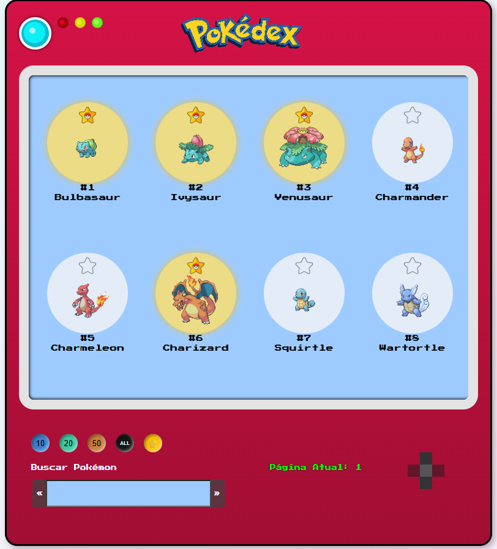
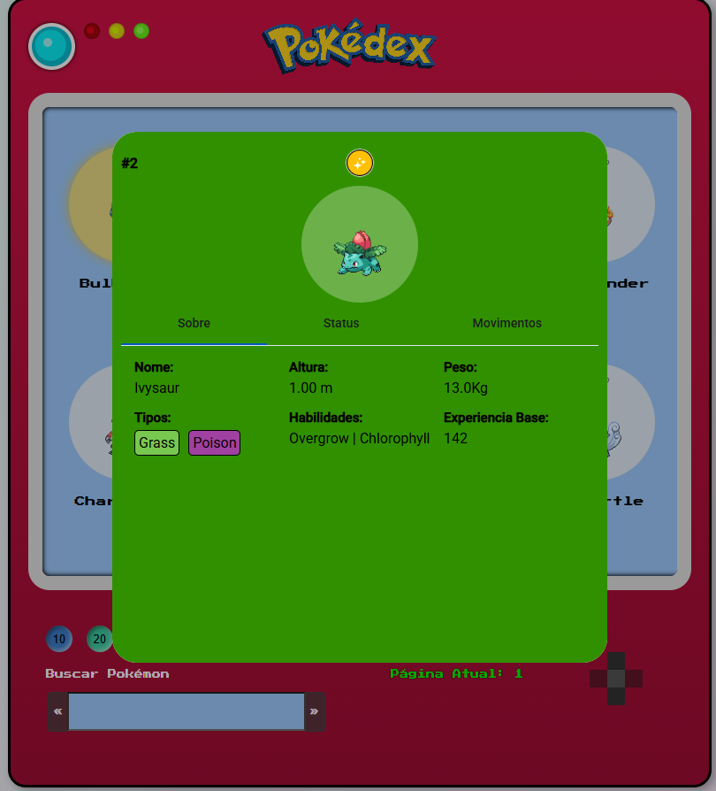
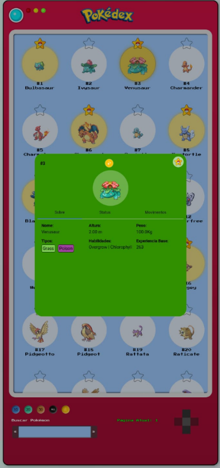
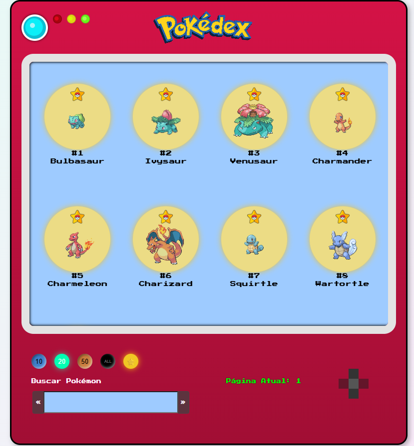
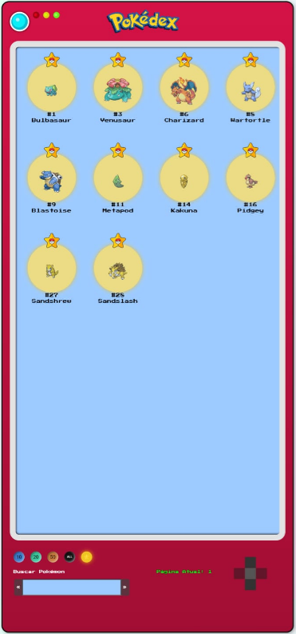

<div align="right">

[](https://giselida-pokedex-pwa.app/deploys)

</div>

<div align="right">

[](README.md)

</div>

<p align="center">
  
</p>

<p align="center"> 
  

  

  <a href="https://github.com/giselida">
  
  </a>

  

  
</p>

<p align="center">
 <a href="#eye_speech_bubble-visualizar">Visualizar</a> •
 <a href="#information_source-sobre">Sobre</a> •
 <a href="#arrow_forward-executar">Executar</a> •
 <a href="#hammer_and_wrench-tecnologias">Tecnologias</a> • 
 <a href="#brain-conceitos-aplicados">Conceitos</a> •
 <a href="#sparkles-funcionalidades">Funcionalidades</a> •
 <a href="#boy-autor">Autor</a> •
 <a href="#balance_scale-licença">Licença</a>
</p>

---

## :eye_speech_bubble: **Visualizar**

<div align="center">

Deploy do front-end efetuado no [Netlify](https://www.netlify.com/) para visualizar: [Clique Aqui](https://giselida-pokedex-pwa.netlify.app/)

|                              :computer:Desktop                               |                              :iphone: Mobile                               |
| :--------------------------------------------------------------------------: | :------------------------------------------------------------------------: |
|  <kbd></kbd>  |  <kbd></kbd>  |
| <kbd></kbd> | <kbd></kbd> |
| <kbd></kbd> | <kbd></kbd> |

</div>

---

## :information_source: **Sobre**

<div align="center">

Minha aplicação que simula uma Pokédex!

---

</div>

## :arrow_forward: **Executar**

<div align="center">

Para executar este projeto você precisa clonar este repositório, ter o Gerenciador de Pacotes do Node ([`NPM`](https://www.npmjs.com/get-npm)) ou o Gerenciador de Pacotes YARN ([`YARN`](https://yarnpkg.com/getting-started)) instalados.

Abra o prompt de comando no diretório do projeto na pasta <code>giselida-pokedex-pwa</code> e execute os seguintes comandos:

<details>
  <summary><i>Usando <b>npm</b></i></summary>

```bash
# Instalar dependências
npm install

# Iniciar o servidor de desenvolvimento
npm start
```

</details>

<details>
  <summary><i>Usando <b>yarn</b></i></summary>

```bash
# Instalar dependências
yarn install

# Iniciar o servidor de desenvolvimento
yarn start
```

</details>

> ⚠️ O servidor de desenvolvimento será iniciado na porta **4200** – acesse <http://localhost:4200>

</div>

---

## :hammer_and_wrench: **Tecnologias**

<div align="center">

|               :globe_with_meridians: FrontEnd               |
| :---------------------------------------------------------: |
|              [Angular 20](https://angular.io/)              |
|     [Angular Material 20](https://material.angular.io/)     |
|       [Testing Library](https://testing-library.com/)       |
|      [Typescript 4.5](https://www.typescriptlang.org/)      |
| [RxJS 7.1](https://rxjs-dev.firebaseapp.com/guide/overview) |
|               [SCSS](https://sass-lang.com/)                |

</div>

---

## :brain: **Conceitos Aplicados**

<div align="center">

|           :brain:           |
| :-------------------------: |
|        Atomic Commit        |
|      HTTP Interceptors      |
|           Signals           |
|    Observable Operators     |
|    Conventional Commits     |
| HTTP Requests API Consuming |
|            RXJS             |
| Progressive Web Application |
| Dynamic Template Rendering  |

</div>

---

## :sparkles: **Funcionalidades**

<div align="center">

|              :page_facing_up:               |
| :-----------------------------------------: |
|           Cache dados do pokémons           |
| Acesso aos detalhes de cada um dos Pokémons |
|      Filtro de pokémons por favoritos       |
|       Filtro de pokémons por pesquisa       |
|              Modal de exibição              |
|               Variáveis scss                |

</div>

---

## :girl: **Autor**

<div align="center">

<a href="https://github.com/giselida">
 
 <br/>
 <sub><b>Gisélida Cristine de Melo</b></sub>
</a>

Desenvolvido com ❤️ por Gisélida Cristine de Melo 👋🏽

[](https://www.linkedin.com/in/giselida-cristine/)
[](https://github.com/giselida)
[](mailto:giselidac@gmail.com)

</div>

---

## :balance_scale: **Licença**

<div align="center">

Copyright © 2021 [Gisélida Cristine de Melo](https://github.com/giselida).  
Este projeto está licenciado sob a [MIT](./LICENSE).

</div>
